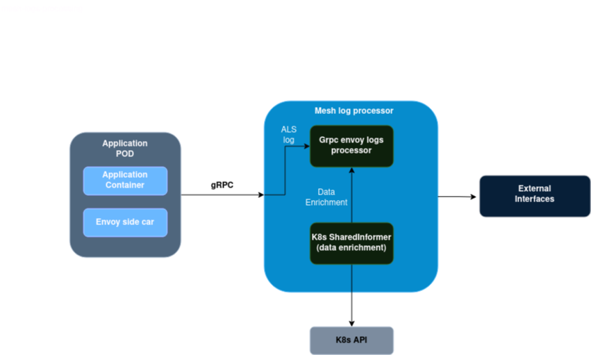

## Service mesh API endpoint discovery based on Envoy and K8s Informer

### Logical Architecture



### Local development

Build docker image using minikube

```bash
eval $(minikube docker-env)

docker build -f build/Dockerfile . -t receiver:latest
```

Deploy to minikube

```bash
# permissions for envoy-receiver
kubectl create -f deploy/cluster-role.yaml
kubectl create -f deploy/cluster-role-binding.yaml

# envoy-receiver with service
kubectl apply -f deploy/envoy-receiver.yaml
```
